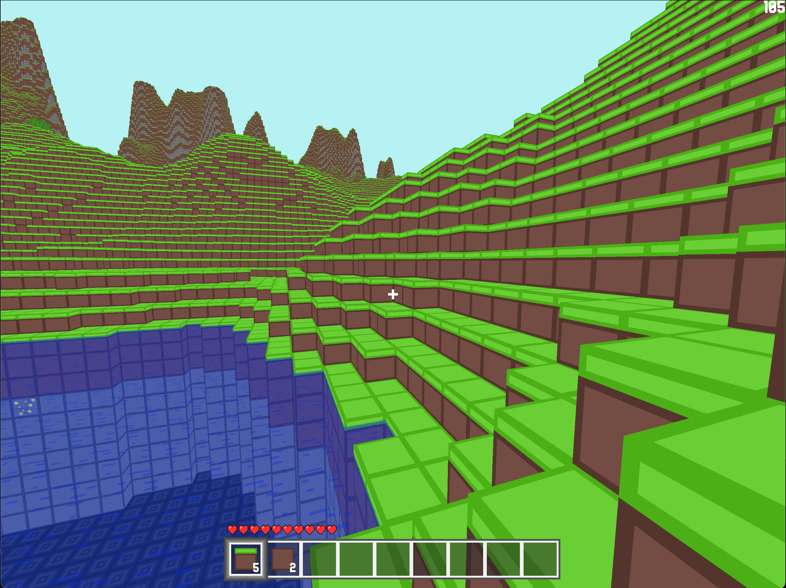

# MK Engine (MKE)

A personal general purpose C++ game engine.

## Showcase

* Matcraft - [YouTube video](https://www.youtube.com/watch?v=bLl5hqfrlBY).
  This is a project of mine I made in 6 days for my computer graphics class.
  It's source is at `examples/Matcraft`
  * Features
    * Creative/Survival modes
    * Big worlds
    * Randomized worlds using perlin noise
    * Optimized rendering
    * Destroyable/placeable blocks
    * Transparent materials
    * Simple 3D physics (player/world collisions)
  
  
  

## Setup

Required libraries:
* FreeType2

Suggested build config:

```bash
cmake -B build -D CMAKE_BUILD_TYPE=Release -D CMAKE_CXX_COMPILER=clang++
```

## Acknowledgments

* Roboto font
* Born2bSportyV2 font
* [GLFW](https://www.glfw.org/)
* [FreeType2](https://freetype.org/)
* [nlohmann-json](https://github.com/nlohmann/json)
* [Glad](https://glad.dav1d.de/)
* [Stb](https://github.com/nothings/stb)
* [Reputeless/PerlinNoise](https://github.com/Reputeless/PerlinNoise)
